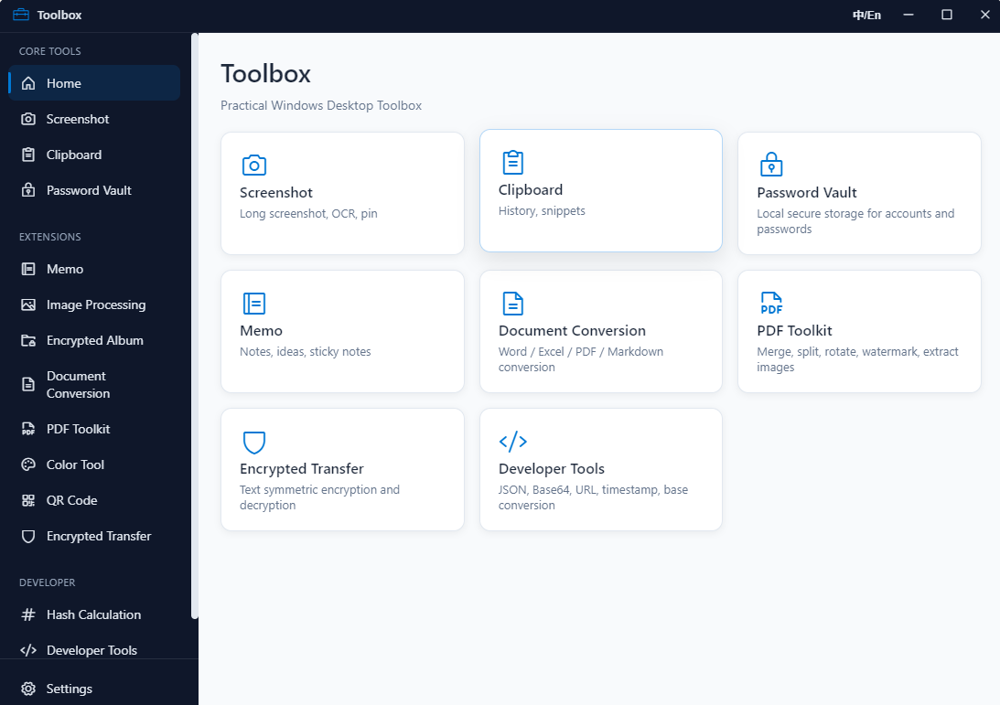

# Toolbox

A Windows desktop productivity toolbox built with Electron, featuring screenshot, clipboard management, password vault, OCR, PDF tools, and more.

## Tech Stack

- **Electron** — Cross-platform desktop application framework
- **Node.js** — Main process and renderer process scripts
- **Embeddable Python Runtime** — Backend capabilities such as OCR and PDF/Office document conversion
- **Phosphor Icons** — Icon library

## Features

- Region screenshot / long screenshot / color picker
- Clipboard history monitoring and management
- Password vault (locally encrypted storage)
- OCR text recognition
- PDF toolbox (conversion and processing)
- Office document conversion
- QR code generation and recognition
- Hash calculation / image compression and other practical utilities

## Screenshots

<p align="center">
  
  <br><em>Home</em>
</p>

## Directory Structure

```
Toolbox/
├── assets/               # App icons and other assets
├── pages/                # Feature pages
├── python/               # Python backend scripts
│   ├── converters/       # Document converters
│   ├── runtime/          # Embeddable Python runtime (not committed)
│   └── convert.py        # Conversion entry point
├── main.js               # Electron main process
├── preload.js            # Preload script
├── app.js                # Renderer process entry
├── i18n.js               # Internationalization
├── index.html            # Main window page
└── package.json
```

## Environment Setup

1. Install Node.js (18+ recommended)
2. Install project dependencies:

```powershell
cd Toolbox
npm install
```

3. Initialize the embeddable Python runtime (required for OCR, PDF, and other features):

```powershell
npm run setup:python-runtime
```

## Development

```powershell
npm run dev
```

## Build

```powershell
# Windows installer
npm run build:win
```

Build artifacts are output to the `dist/` directory.

## Notes

- `python/runtime/`, `node_modules/`, `dist/`, and other directories are excluded via `.gitignore` and will not be tracked.
- OCR model files (`*.traineddata`) are included in the repository, so no additional download is required.

## License

MIT
