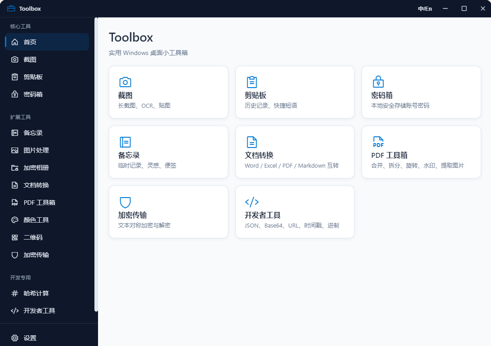

# Toolbox

一个基于 Electron 的 Windows 桌面效率工具箱，集成截图、剪贴板管理、密码箱、OCR、PDF 工具等常用功能。

## 技术栈

- **Electron** — 跨平台桌面应用框架
- **Node.js** — 主进程与渲染进程脚本
- **嵌入式 Python 运行时** — OCR、PDF/Office 文档转换等后端能力
- **Phosphor Icons** — 图标库

## 主要功能

- 区域截图 / 长截图 / 取色器
- 剪贴板历史监听与管理
- 密码箱（本地加密存储）
- OCR 文字识别
- PDF 工具箱（转换、处理）
- Office 文档转换
- 二维码生成与识别
- 哈希计算 / 图片压缩等实用小工具

## 界面截图

<p align="center">
  
  <br><em>首页</em>
</p>

## 目录结构

```
Toolbox/
├── assets/               # 应用图标等资源
├── pages/                # 功能页面
├── python/               # Python 后端脚本
│   ├── converters/       # 文档转换器
│   ├── runtime/          # 嵌入式 Python 运行时（不提交）
│   └── convert.py        # 转换入口
├── main.js               # Electron 主进程
├── preload.js            # 预加载脚本
├── app.js                # 渲染进程入口
├── i18n.js               # 国际化
├── index.html            # 主窗口页面
└── package.json
```

## 环境准备

1. 安装 Node.js（建议 18+）
2. 安装项目依赖：

```powershell
cd Toolbox
npm install
```

3. 初始化嵌入式 Python 运行时（用于 OCR、PDF 等功能）：

```powershell
npm run setup:python-runtime
```

## 开发运行

```powershell
npm run dev
```

## 打包构建

```powershell
# Windows 安装包
npm run build:win
```

构建产物输出到 `dist/` 目录。

## 注意事项

- `python/runtime/`、`node_modules/`、`dist/` 等目录已加入 `.gitignore`，不会进入版本控制。
- OCR 模型文件（`*.traineddata`）随仓库提供，无需额外下载。

## License

MIT
